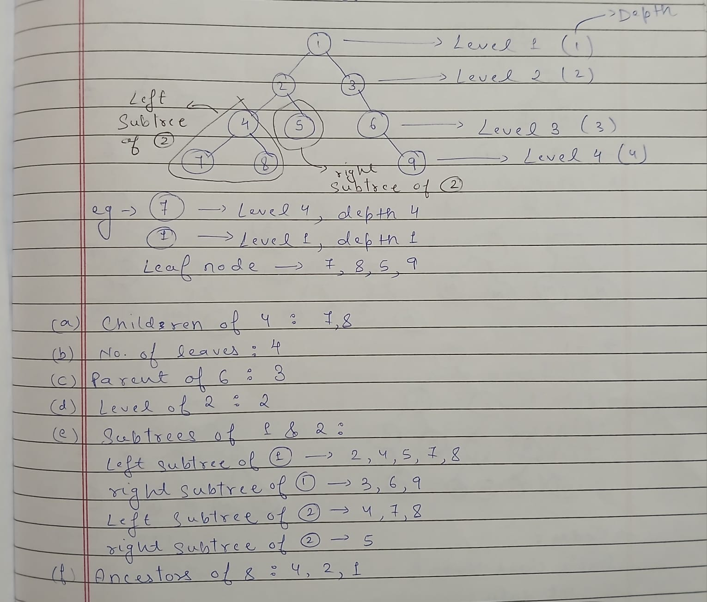

# Trees - Data Structure & Algorithms
### What are Trees?
A tree is a non-linear, hierarchical data structure composed of collection of entities called nodes that are connected by edges. 

### Some of the core Terminologies of Trees
1) Root: The topmost node of the tree, which has no parent.
2) Edge: The link or connection between a parent node and a child node.
3) Parent: A node that is an immediate predecessor to another node.
4) Child: A node that is an immediate successor to another node.
5) Leaf: Nodes situated at the bottom of the tree that have zero children.
6) Subtree: A smaller section of the tree consisting of a node and all its descendants.
7) Depth: The number of edges along the path from the root node to a specific node.
8) Height: The length of the longest path from the root node down to any leaf node.
9) Ancestor: Any node on the path from the root to a given node (excluding the node itself).
10) Level of a Node: The number of edges in the path from the root to that node (The root node is at level 0).

### Some of the common Types of Trees
1) General Tree: A tree with no restriction on the number of children per node.
2) Binary Tree: Every node can have a maximum of two children, called the left and right child.
  - Full Binary Tree: Every node has either 0 or 2 children.
  - Complete Binary Tree: All tree levels are completely filled with nodes except possibly the final level.
  - Perfect Binary Tree: A structure where all internal nodes have exactly two children, and every single leaf node sits at the exact same depth level.
  - Balanced Binary Tree: The height of the left and right subtrees of any node differ by at most one.
  - Skewed Binary Tree: A specific type of degenerate tree that is heavily dominated by one side. It is classified as either left-skewed or right-skewed.
3) Binary Search Tree (BST): A node-based structure where values in the left subtree are strictly lesser than the parent node, and values in the right subtree are strictly greater.
4) AVL Tree: A self-balancing binary search tree where the difference in heights between the left and right subtrees of any node is at most one.
5) Red-Black Tree: Another self-balancing BST that attaches a "red" or "black" color property bit to every single node. The color rules prevent the tree from becoming skewed during updates.
6) B-Tree: A self-balancing tree data structure commonly used in databases and file systems. It maintains sorted data and allows searches, sequential access, insertions, and deletions in logarithmic time.

## Here are some of the Trees questions:
- [Easy Level Questions](leetcode_solutions/easy/README.md)